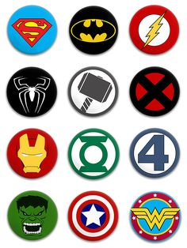
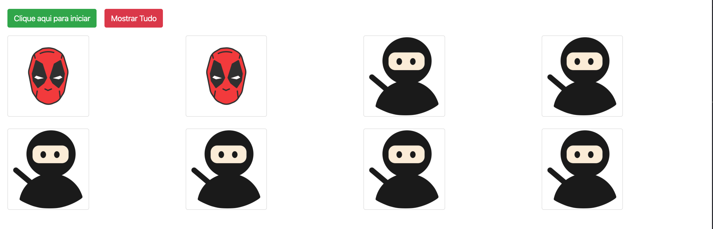

<h1 align="center">
 
  
 
 
  Memory Game
</h1>

<h4 align="center">
  The memory game is a classic game made up of pieces that feature a figure on one side. Each figure is repeated in two different pieces. To start the game, the pieces are placed with the figures facing downwards, so that they cannot be seen. Each participant must, in turn, turn two pieces and let everyone see them. If the figures are the same, the participant must collect this pair with him and play again. If they are different pieces, they must be turned over again, and the next participant must pass the turn. Whoever has the most pairs at the end of the game wins the game.
</h4>

👉 [Link](https://joaoathaide.github.io/memory-game/) to play, have fun 😉

  
  

  <a href="#rocket-technologies">Technologies</a>&nbsp;&nbsp;&nbsp;|&nbsp;&nbsp;&nbsp;
  <a href="#getting-started">Getting started</a>&nbsp;&nbsp;&nbsp;|&nbsp;&nbsp;&nbsp;
  <a href="#contributing">Contributing</a>&nbsp;&nbsp;&nbsp;|&nbsp;&nbsp;&nbsp;
  <a href="#license">License</a>

    

## :rocket: Technologies

-   [Node.js](https://nodejs.org/en/)
-   [Bootstrap 4](https://getbootstrap.com/docs/4.4/getting-started/introduction/)
-   [VS Code](https://code.visualstudio.com) with [ESLint](https://marketplace.visualstudio.com/items?itemName=dbaeumer.vscode-eslint)

## Getting started

1. Clone this repo using `git@github.com:joaoathaide/memory-game.git`
2. Move to the appropriate directory: `cd memory-game`. 
3. Run `yarn` to install dependencies. 
4. Drag the `index.html` to the `browser`. 

## Contributing

Please read [CONTRIBUTING.md](CONTRIBUTING.md) for details on our code of conduct, and the process for submitting pull requests.

## License

This project is licensed under the MIT License - see the [LICENSE.md](LICENSE.md) file for details.

Made with ♥ by João Athaide
